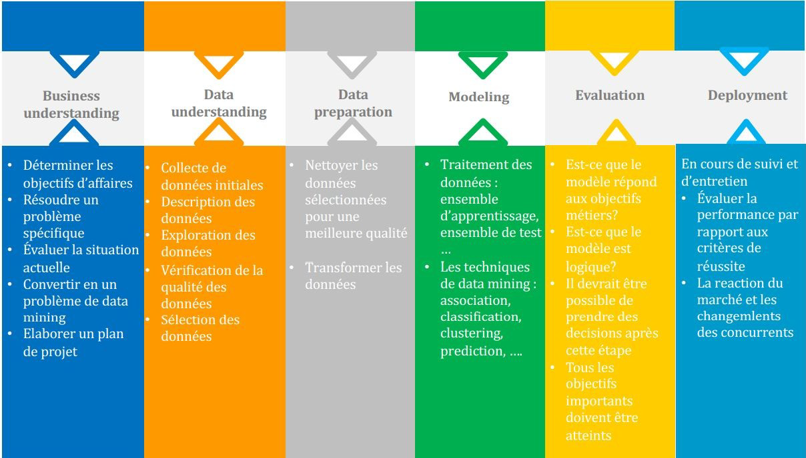
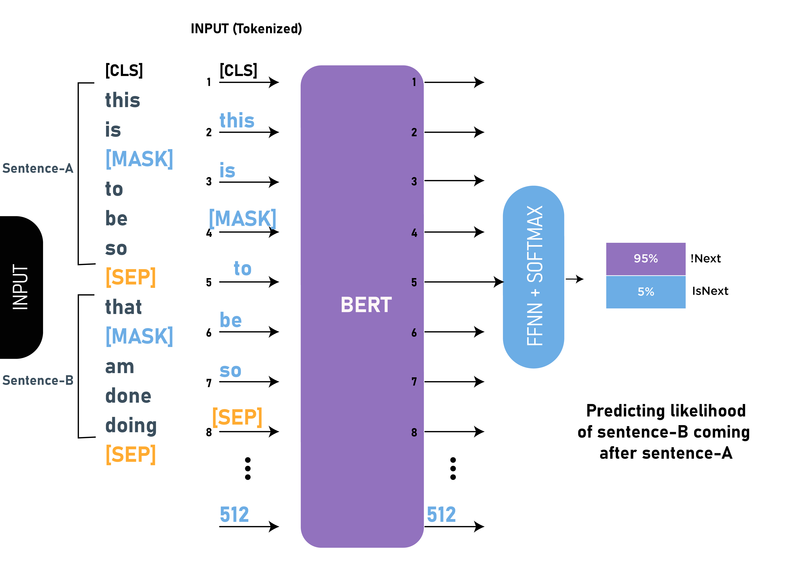
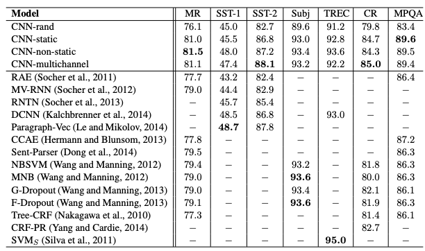
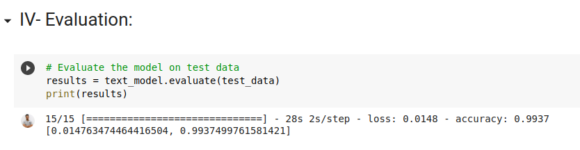

# Prediction of business activity

This model is able to detect if a company is employing AI in its activities using as input the text description of the company with more than 0.99 of accuracy.

### Methodoloy of work:
In this project I used the CRISP-DM methodology because it’s the newest one.
This fgure below shows the diferenet steps CRISP-DM:

### Encoding the text data:
For text encoding there is a lot of transformers (like TF-IDF) but most of them are simple so I used Bert to encode the text data which is one of the newest NLP transformers (created by Google on October, 25, 2019).
Also This model is bidirectional (can read a text from either left-to-right or right-to-left)
and I read articles which prove that it’s the best method in NLP to understand context-heavy texts.
This is a fgure that shows the Bert architecture:

### Training Model:

To train the model I decided to use the CNN which is known more in computer vision tasks but there is many use cases in NLP.
They use the concept of a convolution, a sliding window or filter that passes over the image, identifying important features and analyzing them one at a time, then reducing them down to their essential characteristics, and repeating the process.
It turned out that this approach works well for NLP as well. In 2014, Yoon Kim published the original research paper on using CNNs for text classifcation. He tested four CNN variations, and showed CNN models could outperform previous approaches for several classifcation tasks and these are the results.

This fgure illustrates the CNN architecture:

And fnally the CNN architecture gives me a good result with more than 0.99 of accuracy which is demonstrated in this fgure:

